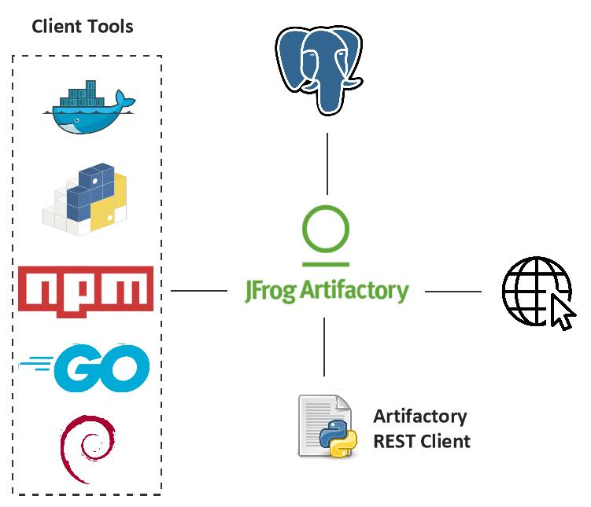
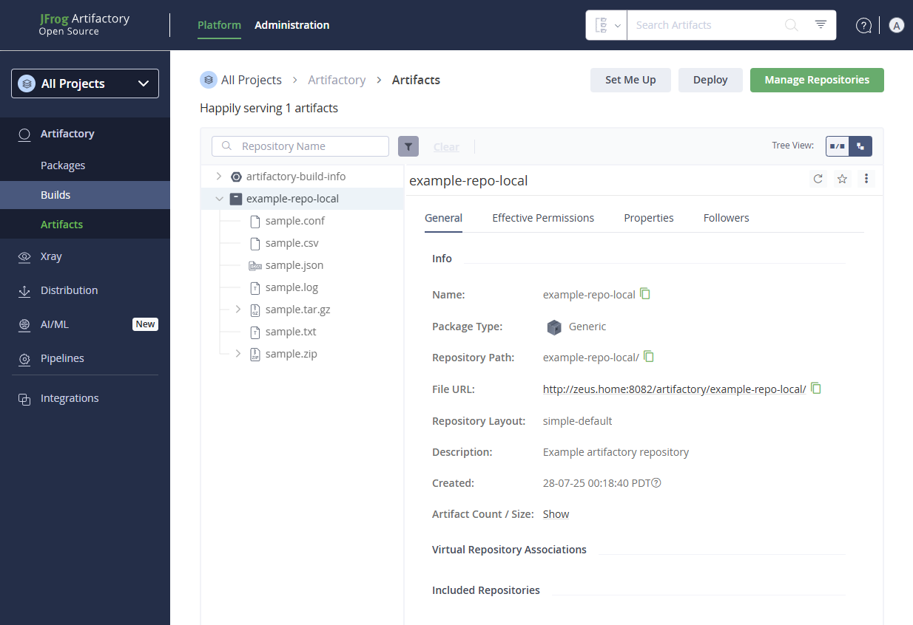

# Cache Forge

Cache-Forge is designed to act as a centralized caching layer for software artifacts, package dependencies, and container images. Its primary goal is to optimize bandwidth usage, reduce external dependency on public registries, and accelerate development workflows across devices in a self-hosted lab environment. By sitting between internal clients and upstream repositories, Cache-Forge ensures that once a dependency is fetched, it is stored locally and served rapidly on subsequent requests.

The project is built around [JFrog Artifactory](https://jfrog.com/artifactory/) that supports a wide variety of artifact types including Python packages (PyPI), JavaScript modules (npm), Docker images, Maven libraries, and more. This universal caching mechanism allows developers and automated CI/CD pipelines in the home lab to reliably access consistent versions of packages, even when disconnected from the Internet or when upstream sources are rate-limited or unavailable. Cache-Forge is particularly valuable in environments with frequent rebuilds or experimentation, ensuring deterministic builds while minimizing redundant downloads. You can find more information on artifactory in [here](./ARTIFACTORY.md).

## System Architecture

We deploy JFrog Artifactory OSS as a containerized service within the home lab or development environment. Running Artifactory inside a container provides a clean, isolated, and easily reproducible runtime that integrates well with the rest of our infrastructure. Note that OSS only supports core formats (Maven, Gradle, Ivy, SBT). "Pro" is the minimum required license to use PyPI and other modern package types (npm, Go, Docker remote).

To ensure data durability and production-grade resilience, we configure Artifactory to use an external PostgreSQL database instead of its default embedded Derby database. While Derby is lightweight and convenient for quick demos or evaluation, it is file-based, lacks crash resilience, and is not suitable for persistent or production use especially within containers, where file system volatility is a concern. PostgreSQL, on the other hand, provides a reliable and fully transactional relational database engine that can safely handle Artifactory’s metadata storage, including artifact relationships, checksums, repository configurations, access permissions, and build information.

In this architecture, binary artifacts are stored on persistent disk volumes, while metadata is stored in PostgreSQL, ensuring that both the contents and context of every artifact remain intact across restarts, crashes, and upgrades. This setup gives us the flexibility and reliability needed for long-term artifact management, and allows us to treat our artifact infrastructure with the same seriousness as our source code and production workloads.

Artifactory acts as a proxy for public package sources like PyPI, Docker Hub, or Go proxy servers. Client tools are repointed to Artifactory, so they no longer fetch packages from the Internet directly. Artifactory caches those packages locally on first access, and serves them from cache on subsequent requests.

The [Artifactory_API](./artifactory_api.py) class is a custom Python wrapper for interacting with the JFrog Artifactory instance via its REST API. It provides a comprehensive interface to perform key operations such as listing repositories, uploading and downloading files, retrieving artifact metadata, checking for file existence, managing directories, and inspecting download statistics. Designed to support automation and scripting use cases, this class can integrate with local tools or CI workflows, allowing developers to manage artifacts programmatically within their home lab or production environments.

## Getting Started

Start all containers in the background:

    docker compose up -d

Wait for the artifactory container to come up. Access the web UI from the following and go over the initial configuration:

    http://localhost:8082

Verify that artifactory REST is working:

    curl -u <username>:<password> http://localhost:8081/artifactory/api/system/version

You can setup access token and invoke like:

    curl -H "Authorization: Bearer <your_token>" http://localhost:8081/artifactory/api/system/version

The [main.py](main.py) Python script automates the process of connecting to the JFrog Artifactory OSS instance, uploading sample files, and listing repository contents. This script is useful for automated artifact population and verification in a home lab or CI environment.

